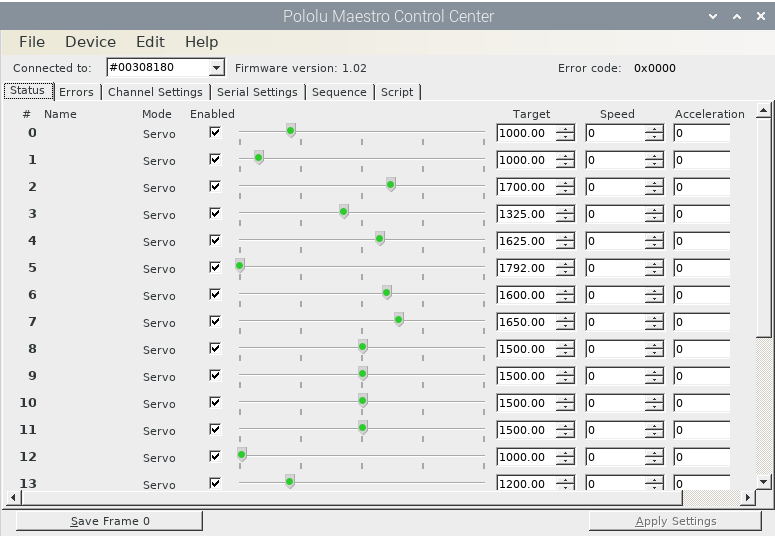
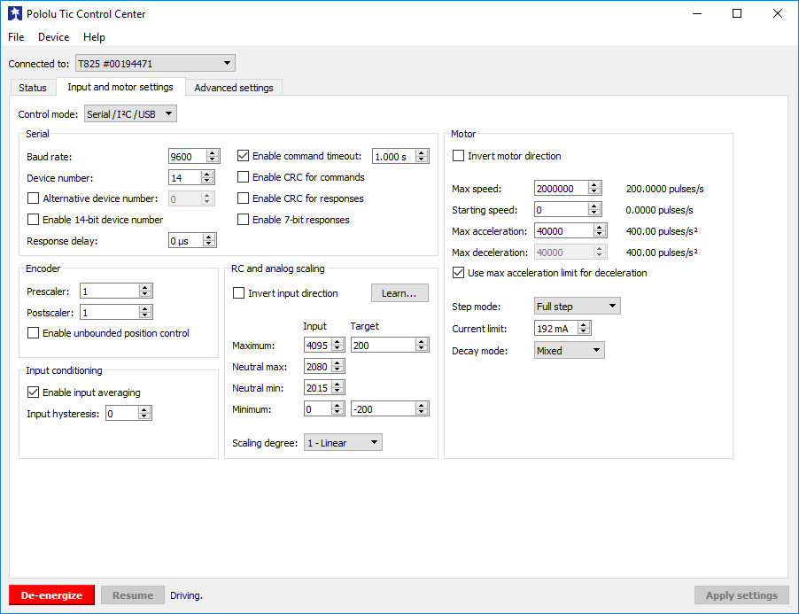

=======================
Changing Movement Range
=======================

There are two loactions that the range of the outputs can be adjusted. The first is 
in Python code and the second is in the settings of the Pololu Maestro Board. These 
two sources do not change the range in the same way. The Python code determines the 
output value used in order to move the motors. The Maestro board provides a limit to 
the allowable range for each output channel. If the Maestro board receives an output 
that is outside its defined range, it will limit the value to the edge of its range. 
So the settings on the Maestro functions more like a safety in how the Maestro board 
is being utilized for Cosmotron and the Python code defines the range which impacts 
how the input values from the PlayStation 4 (PS4) Dual Shock controllers are mapped 
to the output values. How to change both are outlined in the following sections.

.. _pyrange:

Defining Output Ranges in Python Code
=====================================

The class, MovementMap, contained in the file MovementMap.py, is were the ranges for 
each output is defined. Thes values are defined in the beginning of the class' 
constructor. Output objects are created for each movement group. After each object is 
created, it has it's minimum, default, and maximum output values defined by using the 
set_outputs method of the output object. The object is then added to a list used for 
a sequential startup of the Maestro channels, but this is irrelavant to the output 
ranges. The following code block is an excerpty from MovementMap.py:

.. code-block:: python
    :lineno-start: 78

    # Left Ear
    self.left_ear = EarOutput("left ear", 1, [1], ["down_button_1", "left_button_1"])
    self.left_ear.set_outputs([4000], [4000], [8000])
    self.output_objects.append(self.left_ear)

    # Eyelids
    self.eyelids = AnalogOutputObject("eylids", 2, [2, 3])
    self.eyelids.set_outputs([6800, 5300], [6800, 5300], [6050, 6550])
    self.output_objects.append(self.eyelids)

This format is used for each movement group contained in the MovementMap class. To 
accomodate the varying circumstances of each movement group and how many motors it 
will output to, the inputs to the set_outputs method takes three lists. The first 
list contains the minimum output values. The second list contains the default output 
values which are used on startup to match the motors with the default inputs from 
PS4 controllers and for some complicated movement groups. The third list contains 
the maximum output values.

The code above provides two examples of setting the range. One with only one output 
channel and one with two output channels. The number of output channels, as well as 
which channels to output to, are determined by the inputs passed to the constructor 
of the output object. The exact inputs differ depending on the output object, but 
each output object constructor takes the same first three inputs. These are, in 
order, movement group name, number of output channels, and which channels to output 
to.

.. note::

    Order of the elements in the list matters.

The number of elements in each list passed to the set_outputs method needs to match 
the number output channels for that object. So for the left ear, which only has one 
output, each list has one value which correspond directly to the max, default, and min 
output values. The eyelids have two outputs, so each list in the set_outputs method has 
two values. For these situations with more than one output for the movement group, the 
order of the values in each list matters. The first value in the min, default, and max 
lists corresponds to the first value in the list defining the output channels. The 
second value in the min, default, and max lists corresponds to the second value in the 
list defining the output channels and so on.

This means that for the left ear, it only sends outputs to channel one on the Maestro 
board. The minimum value that is output is 4000 and the maximum is 8000. By default, 
the value 4000 is sent to this channel.

Looking at the eyelids, this movement group outputs to channels 2 and 3 on the 
Maestro. For channel 2, the minimum value is 6800 and the max is 6050. For channel 
3, the minimum value is 5300 and the max is 6550. The defaults for channels 2 and 3 
are 6800 and 5300 respectively.

.. code-block:: python
    :lineno-start: 117

    # Right Lip
    self.right_lip = SideLipOutput("right lip", 2, [14, 15], ["circle_button_2", "x_button_2"])
    self.right_lip.set_outputs([6500, 5000], [6000, 6000], [5500, 7000])
    self.output_objects.append(self.right_lip)

Here is another example to illustrate that sometimes the minimum value is set higher 
than the maximum value. Doing this "inverts" the output. More specifially, a minimum 
input value maps to the value set as the minimum for the output value. The same goes 
for the maximums. Maximum input value maps to the value set for the maximum output 
value. So the right lip outputs to channels 14 and 15 (set by the list [14, 15] 
passed to the constructor). Channel 14 has its minimum output set to 6050 and its 
maximum output set to 5500. Channel 15 has its minimum output set to 5000 and its 
maximum output set to 7000. The defaults for channels 14 and 15 are both 6000.

Defining Output Limits in Maestro Settings
==========================================

**Maestro Servo Controller**

There are two main ways to change the range limits for the Maestro board. One is 
to use the Maestro Control Center software. The other is to use UscCmd command 
line software that comes with the linux-maestro files. Ultimately, both depend on 
loading or modifying a settings file. The control center software is a GUI that 
lets you change the settings interactively and thus is more user friendly.

As mentioned, the most user friendly option to change the channel range limits is 
through the control center software. This can be download for the needed operating 
system from the `Maestro user manual on Pololu's website 
<https://www.pololu.com/docs/0J40/all#3>`_. Any questions on how to use the 
control center properly that is not answered by this document for Cosmotron can be 
found in the user manual for the Maestro board from Pololu.

    The status tab of the Maestro Control Center GUI

The two main tabs on the control center that are important for configuring settings 
are the following:

* Channel Settings
* Serial Settings

In the *Channel Settings* tab you are able to set the min and max allowable pulse 
range, in microseconds, of each output channel. In the *Serial Settings* tab, the 
serial mode must be set to *USB Dual Port* in order for the commands to be properly 
sent from the Raspberry Pi.

The changes to the settings are applied to the Maestro board by clicking on the 
*Apply Settings* button on the bottom right part of the control center window. 
These settings persist on the board until they are changed again in the control 
center or by loading a settings file. The settings file is generated by selecting 
the *Save settings file...* option in the File drop down menu at the top of the 
control center. To load a settings file, use the *Open settings file...* option 
from the same menu. It is recommended to keep a file of the desired settings on 
the Maestro used for Cosmotron in case the Maestro board needs to be changed.

The settings file is a simple text file that can easily be edited using any text 
editor. It uses tags like HTML to specify the different settings and their values.

**Tic Stepper Driver Boards**

It is important to mention the Tic Stepper Motor Driver boards in this section 
since they also have settings that impact the motor movement of the few stepper 
motors being used. The Tic boards also use settings files that can be saved and 
loaded like the Maestro boards do. There is also control center software that is 
used to set the settings on the Tic board. The software can be found for various 
operating systems in the `Tic user manual on Pololu's website 
<https://www.pololu.com/docs/0J71/all#3>`_.

Currently, the Tic boards have their *Control Mode* set to *RC Position Control* 
so the steppers are moved to specific positions based off of the output the Tic 
board receives from the Maestro board. The settings for this mode are set in the 
*RC and analog scaling* section of the *Input and motor settings* tab. Using the 
learn button, the min, neutral, and max values can be set for what the Maestro 
board is set to output. However, the important setting that really determines the 
range of outputs for the steppers is the target values for the min and max inputs. 
These targets correlate to the position of the motor. If the target for minimum 
input is set to -200 and the target for maximum input is set to 200, the motor will 
travel 400 steps to go between the minimum and maximum positions.

    The Input and motor settings tab of the Tic Control Center

.. note:: To connect Cosmotron's Maestro to a computer, the USB port in Cosmotron's 
    access panel can be used. However, to connect to the Tic boards in order to 
    change their settings, the boards must currently be removed from inside 
    Cosmotron.

    The Maestro has a USB-B Mini port, but the access panel it is connected to 
    has a USB-A port. The Tic boards have a USB-Micro port. Before trying to change 
    settings on either board make sure you have the proper USB cable.